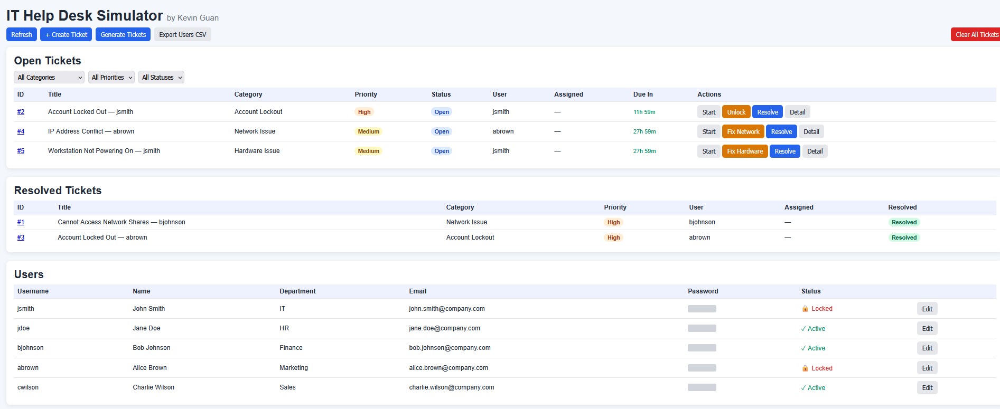

# IT Help Desk Simulator

A browser-based IT help desk training tool built with Flask. Simulates a real ticketing environment: manage users, resolve incidents, and work through Active Directory tasks.

**[Live Demo →](https://it-sim-1.onrender.com)**



---

## Features

### Ticket Management
- Generate random support tickets across six categories: Password Reset, Account Lockout, New Hire Setup, Software Installation, Hardware Issue, and Network Issue
- Priority levels (Critical / High / Medium / Low) with automatic due-in countdowns
- Filter tickets by category, priority, and status
- Add work notes to document resolution steps

### Simulated Active Directory
- Five pre-seeded users across IT, HR, Finance, Marketing, and Sales departments
- Account lockouts and password resets reflected in real time
- New hire onboarding creates a live AD account with a generated username
- Edit user details, department, groups, and account status

### Computer Inventory
- Workstations tied to users and departments
- Hardware issues take machines offline; fix them to bring them back
- Network issues assign APIPA addresses (169.254.x.x); renew the lease to restore connectivity
- Software installation tracked per machine

### Remote Diagnostic Terminal
Each ticket includes an interactive terminal with commands that mirror real IT tools:

| Command | Description |
|---|---|
| `ping <hostname>` | Check host reachability |
| `ipconfig` / `ipconfig /renew` | View or renew network config |
| `Get-ADUser <username>` | Query Active Directory |
| `net user <user> /active:yes` | Unlock an account |
| `net user <user> <password>` | Reset a password |
| `power-cycle <hostname>` | Bring an offline workstation back online |
| `install <software>` | Deploy software to a workstation |
| `list-software` | View installed software |

### Per-User Sessions
Every visitor gets a fully isolated environment via a session cookie. No login required. Your users, tickets, and computer states are private to you and persist across visits.

---

## Run Locally

```bash
git clone https://github.com/kguan42/it-sim.git
cd it-sim
python -m venv .venv
.venv\Scripts\activate       # Windows
# source .venv/bin/activate  # macOS / Linux
pip install -r requirements.txt
python app.py
```

Open `http://127.0.0.1:5000` in your browser.

---

## Project Structure

```
it-sim/
├── app.py              # Flask routes and session handling
├── models.py           # SQLAlchemy models and business logic
├── templates/
│   └── index.html      # Single-page frontend
├── requirements.txt
├── Procfile            # Gunicorn start command for Render
└── render.yaml         # Render deployment config
```

---

## Author

**Kevin Guan**
